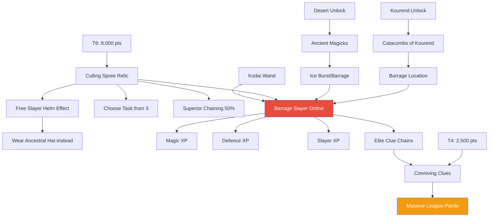
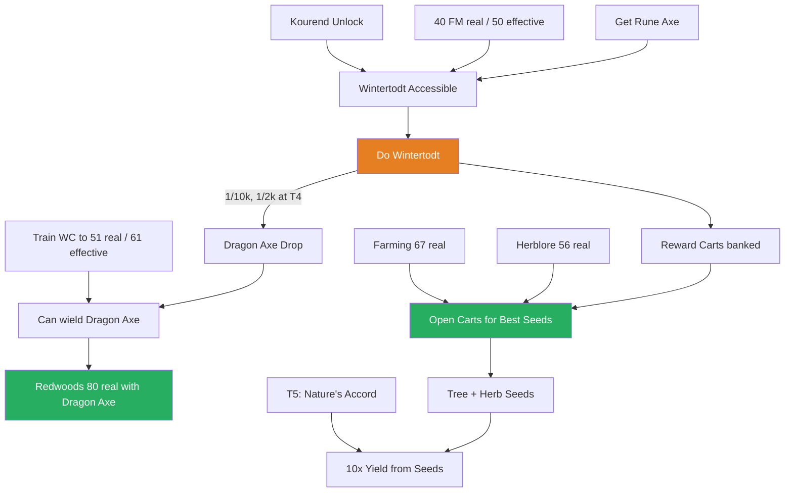
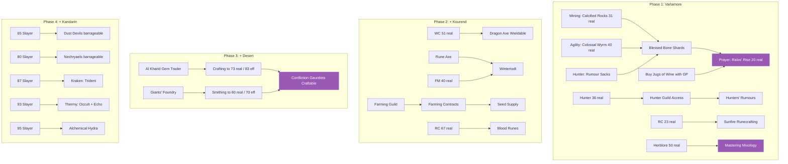
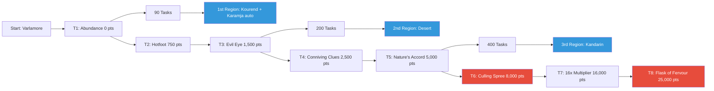

# Dependencies — What Unlocks What

*Mermaid diagrams render on GitHub. Each chain shows prerequisites → unlocks.*

---

## Mage Build Gear

```mermaid
flowchart TD
    subgraph Varlamore["Varlamore (Start)"]
        DOOM[Doom of Mokhaiotl]
        DOOM -->|delve 3+| EOA[Eye of Ayak]
        DOOM -->|delve 4+| TREADS[Avernic Treads]
        DOOM -->|delve 2+| CLOTH[Mokhaiotl Cloth]
    end

    subgraph Kourend["Kourend (1st Region)"]
        COX[Chambers of Xeric]
        COX --> ANCESTRAL[Ancestral Hat/Top/Bottom]
        COX --> KODAI_I[Kodai Insignia]
        COX --> AUGURY[Augury Prayer]
    end

    subgraph Desert["Desert (2nd Region)"]
        MTA[Mage Training Arena]
        MTA --> MASTER_WAND[Master Wand]
        TOA[Tombs of Amascut]
        TOA --> SHADOW[Tumeken's Shadow]
        TOA --> WARD[Elidinis' Ward base]
        ANCIENTS[Ancient Magicks Quest]
    end

    subgraph Kandarin["Kandarin (3rd Region)"]
        GORILLAS[Demonic Gorillas]
        GORILLAS --> ZENYTE[Zenyte Shard]
        SLAYER93[93 Slayer]
        SLAYER93 --> THERMY[Thermonuclear Smoke Devil]
        THERMY --> OCCULT[Occult Necklace]
        THERMY -->|echo orb| ECHO_THERMY[Echo Thermy]
        ECHO_THERMY --> DEVIL[Devil's Element offhand]
    end

    subgraph Crafting["Crafting Chain"]
        ZENYTE --> TORMENTED[Tormented Bracelet]
        TORMENTED --> CONFLICTION[Confliction Gauntlets]
        CLOTH --> CONFLICTION
        CRAFT83[83 Crafting] --> CONFLICTION
        SMITH70[70 Smithing] --> CONFLICTION
    end

    subgraph Kodai["Kodai Chain"]
        MASTER_WAND --> KODAI[Kodai Wand]
        KODAI_I --> KODAI
    end

    style EOA fill:#9b59b6,color:#fff
    style CONFLICTION fill:#9b59b6,color:#fff
    style KODAI fill:#9b59b6,color:#fff
    style OCCULT fill:#9b59b6,color:#fff
    style DEVIL fill:#9b59b6,color:#fff
    style TREADS fill:#9b59b6,color:#fff
    style ANCESTRAL fill:#9b59b6,color:#fff
    style AUGURY fill:#9b59b6,color:#fff
    style SHADOW fill:#9b59b6,color:#fff
    style WARD fill:#9b59b6,color:#fff
```



**Purple = final gear piece.** Mage build is complete when you have all purple nodes.

---

## Barrage Slayer Engine



**Red = core engine. Orange = points output.** Everything feeds into barrage Slayer → clue chains → points.

---

## Wintertodt + Woodcutting Chain



**Key:** Don't push WC past 51 real (61 effective = Dragon Axe wieldable) before Wintertodt. Bank carts, open when Farming/Herblore are high enough.

---

## Skilling Prerequisites



---

## Region + Relic Unlock Chain



---

## Critical Path Summary

The longest dependency chain (what takes the most sequential steps):

```
Kandarin unlock (400 tasks)
  → 93 Slayer (barrage Slayer to level fast)
    → Culling Spree (T6, choose Smoke Devil tasks)
      → Thermonuclear Smoke Devil kills
        → Occult Necklace
        → Echo orb
          → Echo Thermy
            → Devil's Element (BIS offhand)
```

And for Confliction Gauntlets:
```
Kandarin unlock (400 tasks)
  → Demonic Gorillas
    → Zenyte shard
      → Tormented Bracelet (need 93 Magic to enchant, or 83 with Abundance)
        + Mokhaiotl Cloth (Doom of Mokhaiotl, can farm earlier)
        + 83 Crafting (73 real, gem trader in Desert)
        + 70 Smithing (60 real, Giants' Foundry in Desert)
          → Confliction Gauntlets
```

**Bottleneck:** Kandarin is the 3rd unlock (~400 tasks). Everything that needs Kandarin (Confliction, Occult, Devil's Element, chinchompas) is gated behind this. Focus on task completions in Phase 1-3 to reach 400 tasks as fast as possible.

**Second bottleneck:** 93 Slayer for Occult + Echo Thermy. Barrage Slayer with Culling Spree is the fastest path, but that requires Desert (Ancients) + Kourend (Catacombs) + T6 (Culling Spree, 8,000 pts). Start melee Slayer early to build toward this.

---

## Do-Before List

Quick reference: what to do before each key activity.

| Activity | Do First |
|----------|----------|
| **Wintertodt** | WC 51 real (Dragon Axe wieldable), FM 40 real, get a rune axe, unlock Kourend |
| **Open WT Carts** | Farming 67+ real, Herblore 56+ real (for best seeds/herbs) |
| **Redwoods** | WC 80 real. Ideally have Dragon Axe from WT |
| **Barrage Slayer** | Kourend + Desert unlocked, Culling Spree (T6), Kodai Wand (CoX + MTA) |
| **Doom hard-farm** | T4 (5x drops). Before that, just do KC tasks |
| **CoX** | Decent combat stats (~70s-80s). Evil Eye (T3) for teleport |
| **ToA** | Desert unlock. Evil Eye for teleport. Decent gear |
| **Giants' Foundry** | Desert unlock. Bank ores/bars beforehand from Mining + WT carts |
| **Confliction Gauntlets** | Kandarin unlock + zenyte + Mokhaiotl Cloth + 73 real Crafting + 60 real Smithing |
| **Occult Necklace** | Kandarin unlock + 93 Slayer |
| **Devil's Element** | Kandarin unlock + 93 Slayer + Thermy echo orb |
| **Farming contracts** | Kourend unlock (start ASAP — compounds over time) |
| **Mixology** | Herblore 50 real (in Varlamore, no region needed) |
| **Prayer dump** | Bank shards from Mining + Agility + Hunter first. Buy wine with GP |
